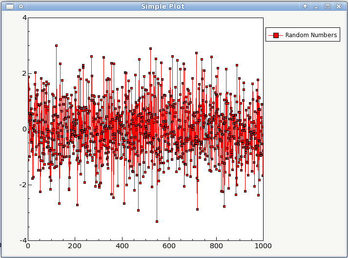

Introduction
============

What is wxgraph?
------------------

Graph is a wxPython widget for making 2d plots of data.

Features?
---------------

Amongst the core features of graph are:

* Basic data visualization primitives: Images, line and scatter plots
* Fast enough for realtime update of video/plot data
* Interactive scaling/panning, averaging, FFTs, SVG/PNG export
* Widgets for marking/selecting plot regions
* Widgets for marking/selecting image region-of-interest and automatically slicing multi-dimensional image data
* Framework for building customized image region-of-interest widgets
* Docking system that replaces/complements Qt's dock system to allow more complex (and more predictable) docking arrangements
* ParameterTree widget for rapid prototyping of dynamic interfaces (Similar to the property trees in Qt Designer and many other applications)

.. _examples:

Examples
--------

This is the simplest way to make a graph in a wx application::

    import wx
    import numpy

    from graph import *

    class MainApp(wx.App):
        def OnInit(self):
            frame = wx.Frame(None, -1, "tst2", size=(700,500))
            graph = Graph(frame)
            dataset = graph.createDataset(numpy.arange(1000),numpy.random.normal(size=1000), "Random Numbers")

            frame.Show()

            return True

    if __name__ == "__main__":
        app = MainApp()
        app.MainLoop()

and it produces a window that looks like

